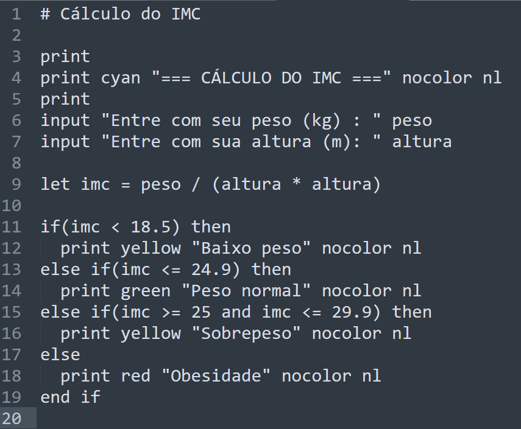
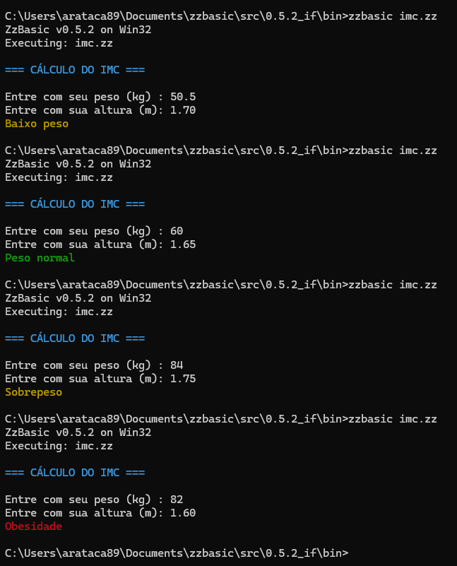

# ZzBasic - Documentação v0.5.2


**ZzBasic** é uma linguagem de programação interpretada que combina a simplicidade do BASIC clássico com recursos modernos. É um projeto solo desenvolvido com cuidado e atenção aos detalhes.

[Manual do Usuário](https://github.com/zzbasic/zzbasic/blob/main/0.5.2/zzbasic_0_5_2_manual.md)

## Versão Atual: **0.5.2**

### 🚀 Características

- ✅ **Sintaxe limpa** - Comandos em caixa baixa (`let`, não `LET`)
- ✅ **Tipagem dinâmica** - Números e strings
- ✅ **REPL interativo avançado** - Com comandos de debug e análise
- ✅ **Execução de arquivos** - Scripts com extensão `.zz`
- ✅ **Múltiplos statements** - Separe comandos com `:`, `;` ou nova linha
- ✅ **Verificação de tipos** - Erros claros em operações inválidas
- ✅ **Gerenciamento de memória** - Sem vazamentos
- ✅ **Análise léxica e AST** - Ferramentas de debug integradas
- ✅ **Comando `print`** - Saída formatada com controle explícito de linha
- ✅ **Atalho `?`** - Alternativa rápida para `print`
- ✅ **Cores no `print`** - Suporte a 24 cores (normais, brilhantes e fundo)
- ✅ **Largura de campo(width) e alinhamento(alignment) no `print`** 
- ✅ **Comando `input`** - Entrada de dados do usuário
- ✅ **Tipo booleano** - `true` e `false`
- ✅ **Operações de comparação** - `==` , `!=` , `<` , `>` , `<=` , `>=`
- ✅ **Operações lógicas** - `and`, `or`, `not`, `!`
- ✅ **Estrutura** `if...else`


**OBSERVAÇÃO**: Não implementa comparação de strings, somente de números e booleanos.

---

### Programa de exemplo - código



---

### Programa de exemplo - execução



---

### 📋 Histórico de Versões

| Versão | Status | Recursos Principais |
|--------|--------|-------------------|
| 0.1.0 | Lançada | Expressões matemáticas básicas |
| 0.2.0 | Lançada | Variáveis (`let`), strings, tabela de símbolos |
| 0.3.0 | Lançada | Múltiplos statements, REPL avançado, comandos de debug |
| 0.4.0 | Lançada | Comando `print`, controle de linha, saída formatada |
| 0.4.1 | Lançada | Comando `print` com cores |
| 0.4.2 | Lançada | Largura de campo e alinhamento no `print` |
| 0.4.3 | Lançada | `input` |
| 0.5.0 | Lançada | tipo booleano |
| 0.5.1 | Lançada | operadores de comparação e operadores lógicos|
| 0.5.2 | Lançada | estrutura `if...else` |
| 0.5.3 | **em desenvolvimento** | loop `while`; `break`; `continue` |
| 0.5.4 | **na fila para desenvolvimento** | loop `for` |

---

## 📥 Instalação e Compilação

### Pré-requisitos

- **Compilador C**: GCC, Clang ou MSVC
- **Make** (opcional)
- **Git** (para clonar)

### Compilação (Linux/macOS)

```bash
# Clone o repositório
git clone https://github.com/zzbasic/zzbasic.git
cd zzbasic/0.5.2

# Compile
make

# Execute
./zzbasic
```

### Compilação (Windows)

```bash
# Com MinGW
cd zzbasic\0.5.2
gcc -o zzbasic *.c
zzbasic.exe
```

---

## 📚 Referência da Linguagem

### Gramática EBNF (v0.5.1) - não foi alterada desde a v0.5.1

```
# =====================================================================
# ZzBasic - GRAMÁTICA COMPLETA v0.5.1
# Estruturas de Controle: if, else if, else, Operadores Lógicos
# Última atualização: 20260204
# =====================================================================

# =====================================================================
# PROGRAMA ESTRUTURAL 
# =====================================================================
program             := statement_list

statement_list      := statement (EOL statement)* EOL?

statement           := assignment_stmt
                    | print_stmt
                    | color_stmt 
                    | input_stmt 
                    | if_stmt
                    | expression_stmt


# =====================================================================
# ASSIGNMENT
# =====================================================================
assignment_stmt     := 'let' IDENTIFIER '=' expression


# =====================================================================
# PRINT STATEMENT
# =====================================================================
print_stmt          := ('print' | '?') print_item* ('nl' | EOL | EOF)

print_item          := expression 
                    | format_directive
                    | color_directive

format_directive    := alignment
                    | width_spec

alignment           := 'left' | 'right' | 'center'

width_spec          := 'width' '(' NUMBER ')'

color_directive     := color_name 
                    | 'nocolor'

color_name          := normal_color
                    | bright_color
                    | background_color

normal_color        := 'black' | 'red' | 'green' | 'yellow'
                    | 'blue' | 'magenta' | 'cyan' | 'white'

bright_color        := 'bred' | 'bgreen' | 'byellow' | 'bblue'
                    | 'bmagenta' | 'bcyan' | 'bwhite'

background_color    := 'bgblack' | 'bgred' | 'bggreen' | 'bgyellow'
                    | 'bgblue' | 'bgmagenta' | 'bgcyan' | 'bgwhite'


# =====================================================================
# COLOR STATEMENT (standalone)
# =====================================================================
color_stmt          := COLOR_TOKEN


# =====================================================================
# INPUT STATEMENT
# =====================================================================
input_stmt          := 'input' (STRING)? IDENTIFIER  


# =====================================================================
# IF STATEMENT
# =====================================================================
if_stmt             := 'if' logical_expr 'then' EOL
                           statement_list
                       ( 'else' 'if' logical_expr 'then' EOL
                           statement_list )*
                       ( 'else' EOL
                           statement_list )?
                       'end' 'if' EOL


# =====================================================================
# EXPRESSIONS (Hierarquia completa)
# =====================================================================

# Statement expression (top-level)
expression_stmt     := logical_expr

# Logical expressions

# Nível 1: OR (mais baixa precedência)
logical_expr        := logical_or_expr

logical_or_expr     := logical_and_expr ('or' logical_and_expr)*

# Nível 2: AND
logical_and_expr    := not_expr ('and' not_expr)*

# Nível 3: NOT (unário)
not_expr            := ('not' | '!')? comparison_expr

# Nível 4: Comparações
comparison_expr     := expression (comparison_op expression)*

comparison_op       := '==' | '!=' | '<' | '>' | '<=' | '>='

# Nível 5: Expressões aritméticas
expression          := term (('+' | '-') term)*

# Nível 6: Termos (multiplicação/divisão)
term                := factor (('*' | '/') factor)*

# Nível 7: Fatores (unários e átomos)
factor              := ('+' | '-')? atom

# Nível 8: Átomos (mais alta precedência)
atom                := NUMBER 
                    | STRING 
                    | 'true' 
                    | 'false' 
                    | IDENTIFIER 
                    | '(' logical_expr ')'


# =====================================================================
# LITERALS
# =====================================================================
COMMENT             := '#' ~[\n\r]*

IDENTIFIER          := [a-zA-Z_][a-zA-Z0-9_]*

NUMBER              := [0-9]+ ('.' [0-9]+)?

STRING              := '"' [^"]* '"'

BOOLEAN             := 'true' | 'false'


# =====================================================================
# KEYWORDS
# =====================================================================
# Comandos
let
print
input
if
then
else
end
and
or
not
nl

# Cores normais
black
red
green
yellow
blue
magenta
cyan
white

# Cores bright
bred
bgreen
byellow
bblue
bmagenta
bcyan
bwhite

# Cores background
bgblack
bgred
bggreen
bgyellow
bgblue
bgmagenta
bgcyan
bgwhite


# =====================================================================
# OPERATORS
# =====================================================================
# Aritméticos
PLUS                := '+'
MINUS               := '-'
MULT                := '*'
DIV                 := '/'

# Atribuição
ASSIGN              := '='

# Comparação
EQUAL               := '=='
NOT_EQUAL           := '!='
LESS                := '<'
GREATER             := '>'
LESS_EQUAL          := '<='
GREATER_EQUAL       := '>='

# Parênteses
LPAREN              := '('
RPAREN              := ')'

# Lógicos (binários)
AND                 := 'and'
OR                  := 'or'

# Lógicos (unários)
NOT                 := 'not' | '!'


# =====================================================================
# HIERARQUIA DE PRECEDÊNCIA 
# 1 - MENOR PRECEDÊNCIA
# 8 - MAIOR PRECEDÊNCIA
# =====================================================================
Nível   Operador                Associatividade     Função do Parser
---------------------------------------------------------------------
1       or                      Esquerda            parse_logical_or_expr()
2       and                     Esquerda            parse_logical_and_expr()
3       not, ! (unário)         Direita             parse_not_expr()
4       ==, !=, <, >, <=, >=    Esquerda            parse_comparison_expr()
5       +, - (binário)          Esquerda            parse_expression()
6       *, /                    Esquerda            parse_term()
7       +, - (unário)           Direita             parse_factor()
8       (), true, false,        -                   parse_atom()
        números, strings, vars


# =====================================================================
# EXEMPLOS VÁLIDOS
# =====================================================================

# 1. Expressões booleanas
#    not x or y and z == 5
#    (not x) or (y and (z == 5))

# 2. Comparações
#    x > 5 and y <= 10
#    nome == "João" or idade >= 18

# 3. NOT com múltiplas formas
#    not x > 5
#    ! x > 5
#    not (x > 5)
#    !(x > 5)

# 4. IF completo
#    if x > 5 then
#        print "Maior que 5" nl
#        let y = x * 2
#    else if x == 5 then
#        print "Igual a 5" nl
#    else
#        print "Menor que 5" nl
#    end if

# 5. Expressões aninhadas
#    if not (x < 0 or y > 100) and z == 50 then
#        print "Condição complexa atendida" nl
#    end if


# =====================================================================
# REGRAS DE ASSOCIAÇÃO IMPORTANTES
# =====================================================================

# 1. 'not' e '!' são SINÔNIMOS e têm a MESMA precedência
#    not x == ! x  (são equivalentes)

# 2. 'and' tem precedência maior que 'or'
#    x or y and z  ==  x or (y and z)

# 3. 'not'/'!' tem precedência maior que comparações
#    not x > 5  ==  (not x) > 5  (CUIDADO! Isso pode não ser intuitivo)
#    Para segurança: use parênteses: not (x > 5)

# 4. Comparações não podem ser encadeadas sem operadores
#    VÁLIDO:    x > 5 and x < 10
#    INVÁLIDO:  5 < x < 10  (não suportado)

# 5. 'if' sempre requer 'then' na mesma linha
#    if x > 5 then  (CORRETO)
#    if x > 5       (ERRADO - falta 'then')
#        then       (ERRADO - 'then' em linha separada)

# 6. Cada bloco (if, else if, else) contém uma statement_list
#    (zero ou mais statements)


# =====================================================================
# NOTAS DE IMPLEMENTAÇÃO PARA O PARSER
# =====================================================================

# 1. Implementar na ordem da precedência (nível 8 para cima):
#    parse_atom() → parse_factor() → parse_term() → parse_expression() →
#    parse_comparison_expr() → parse_not_expr() → parse_logical_and_expr() →
#    parse_logical_or_expr()

# 2. 'not' e '!' devem criar o MESMO nó AST (NODE_NOT_LOGICAL_OP)

# 3. Para o 'if', criar uma estrutura que permita:
#    - Uma condição (logical_expr)
#    - Um bloco then (statement_list)
#    - Lista opcional de else_if (condição + bloco)
#    - Bloco else opcional (sem condição)

# 4. Lembrar que '=' é apenas para atribuição (let x = 5)
#    e '==' é para comparação (x == 5)


# =====================================================================
# CASOS DE BORDA E AMBIGUIDADES RESOLVIDAS
# =====================================================================

# 1. NOT vs negativo unário:
#    - not -5  →  not (-5)    [NOT aplicado ao resultado de -5]
#    - !-5     →  ! (-5)      [equivalente]

# 2. NOT com comparação:
#    - not x == 5  →  (not x) == 5  [por precedência]
#    - Use parênteses para clareza: not (x == 5)

# 3. Múltiplos NOT:
#    - not not x  →  not (not x)    [associatividade à direita]
#    - !!x        →  !(!x)          [equivalente]

# 4. NOT com AND/OR:
#    - not x and y  →  (not x) and y
#    - not (x and y) → precisa de parênteses

# FIM DA GRAMÁTICA DO ZzBasic v0.5.1
# =====================================================================

```

---

## Comportamentos característicos

A instrução:

`print "-10 < 0 ==> esperado true      : " -10 < 0 nl` 

irá gerar o erro

`String cannot be used as number`

pois o intrepretador tentará executar a operação aritmética `string - 10`,
e strings não são aceitas em operações aritméticas.

Para executar este tipo de instrução use parênteses:

`print "-10 < 0 ==> esperado true      : " (-10 < 0 ) nl`


---

## 🚀 Próximas Versões

### v0.5.3 
- Loop `while`
- `break`
- `continue`

### v0.5.4 
- Loop `for`

---

## 📖 Documentação Adicional

Para mais detalhes, consulte o **Manual do Usuário** (em desenvolvimento).

---

## 🤝 Contribuições

ZzBasic é um projeto solo, mas sugestões e feedback são bem-vindos!

---

## 📄 Licença

MIT License

Copyright (c) 2026 arataca89

---

**Última atualização:** Fevereiro de 2026
**Versão:** 0.5.2
---
arataca89@gmail.com

