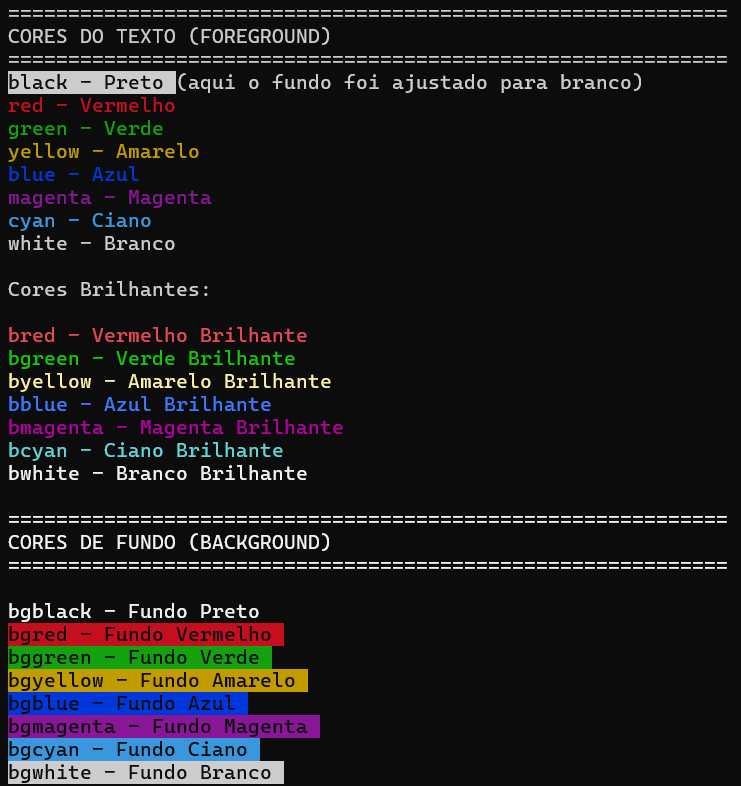

# 📚 ZzBasic v0.6.0 

**Versão:** 0.6.0  
**Status:** Em Desenvolvimento  
**Data:** 21 de Fevereiro de 2026

---

## Índice

1. [Tipos de Dados](#tipos-de-dados)
2. [Operações Aritméticas](#operações-aritméticas)
3. [Variáveis e Atribuição](#variáveis-e-atribuição)
4. [Comando Print](#comando-print)
5. [Comando Input](#comando-input)
6. [Estruturas de Controle](#estruturas-de-controle)
7. [Operadores de Comparação](#operadores-de-comparação)
8. [Operadores Lógicos](#operadores-lógicos)
9. [Cores e Formatação](#cores-e-formatação)
10. [Arrays](#arrays)
11. [Funções Built-in](#funções-built-in)
12. [Módulos e Importação](#módulos-e-importação)
13. [Tipo Text](#tipo-text)

---

## Tipos de Dados

- Número
- String
- Booleano
- Text

### NUMBER (Número)

**Descrição:** Representa valores numéricos de ponto flutuante (double).

**Características:**
- Suporta números inteiros e decimais
- Intervalo: Conforme especificação IEEE 754 (double)
- Exemplos: `3.14`, `-42`, `0`, 
- Não suporta notação científica (`1.5e-10`)

**Exemplo:**
```zzbasic
let pi = 3.14159
let idade = 25
let saldo = -100.50
```
**LIMITAÇÕES**
- O número deve ter no máximo 24 caracteres.

Código:
```
let n = 123456789012345678901234
print "n : " n nl
```

Saída:
```
n :  1.23456789
```

Mas, se tentarmos declarar um número com mais de 24 caracteres:
```
let n = 1234567890123456789012345
print "n : " n nl
```

Saída:
```
[9:9] Lexer error: buffer overflow while reading integer part
  Linha 9: let n = 1234567890123456789012345
                   ↑
```

**Limites Reais:**
- **Maior número positivo**: `1.7976931348623e+308` (≈1.8×10³⁰⁸)
- **Menor número positivo**: `2.2250738585072e-308` (≈2.2×10⁻³⁰⁸)
- **Maior número negativo**: `-1.7976931348623e+308`
- **Menor número negativo**: `-2.2250738585072e-308`

### STRING (Texto)

**Descrição:** Representa sequências de caracteres (texto).

**Características:**
- Delimitado por aspas duplas (`"`)
- Tamanho máximo: 128 caracteres
- Suporta espaços e caracteres especiais

**Exemplo:**
```zzbasic
let nome = "João Silva"
let mensagem = "Olá, mundo!"
let vazio = ""
```

### BOOL (Booleano)

**Descrição:** Representa valores lógicos verdadeiro ou falso.

**Características:**
- Valores: `true` ou `false`
- Resultados de operações de comparação
- Resultados de operações lógicas

**Exemplo:**
```zzbasic
let ativo = true
let desativado = false
let resultado = 5 > 3  // resultado = true
```

### TEXT 

**Descrição:** Tipo customizado para manipulação de texto com operações avançadas.

**Características:**
- Suporta operações de leitura/escrita de arquivo

**Exemplo:**
```zzbasic
let conteudo = load("arquivo.txt")
save conteudo "saida.txt"
```

---

## Operações Aritméticas

### Operadores Básicos

| Operador | Descrição | Exemplo | Resultado |
|----------|-----------|---------|-----------|
| `+` | Adição | `5 + 3` | `8` |
| `-` | Subtração | `10 - 4` | `6` |
| `*` | Multiplicação | `6 * 7` | `42` |
| `/` | Divisão | `20 / 4` | `5` |
| `%` | Módulo (resto) | `17 % 5` | `2` |

### Precedência de Operadores

**Ordem de execução (da maior para menor precedência):**

1. Parênteses `( )`
2. Unário `+`, `-`
3. Multiplicação `*`, Divisão `/`, Módulo `%`
4. Adição `+`, Subtração `-`

**Exemplos:**
```zzbasic
let resultado = 2 + 3 * 4        // = 14 (não 20)
let resultado = (2 + 3) * 4      // = 20
let resultado = 10 - 5 - 2       // = 3 (esquerda para direita)
let resultado = -5 + 3           // = -2
```

### Operador Unário

**Descrição:** Operador aplicado a um único operando.

| Operador | Descrição | Exemplo | Resultado |
|----------|-----------|---------|-----------|
| `+` | Positivo | `+5` | `5` |
| `-` | Negativo | `-5` | `-5` |

**Exemplo:**
```zzbasic
let numero = 10
let negativo = -numero  // = -10
let positivo = +numero  // = 10
```

### Divisão por Zero

**Comportamento:** Retorna erro e interrompe a execução.

```zzbasic
let resultado = 10 / 0  // ❌ Erro: division by zero
```

---

## Variáveis e Atribuição

### Comando LET

**Descrição:** Cria e atribui valor a uma variável.

**Sintaxe:**
```
let <identificador> = <expressão>
```

**Características:**
- Identificador: Começa com letra ou `_`, seguido de letras, números ou `_`
- Tamanho máximo do identificador: 32 caracteres
- Tipagem dinâmica (tipo determinado pelo valor atribuído)
- Depois de atribuído um tipo, a variável será daquele tipo e não poderá receber valor de outro tipo
- Escopo: Global

**Exemplos:**
```zzbasic
let nome = "Alice"
print nome nl

let ativo = true
print ativo nl

let _privado = 42
print _privado nl

let resultado = 5 + 3 * 2 # 11
print resultado nl

let y = 20
print y nl

let y = 30.75
print y nl

let y = "asd" # ERRO - TENTOU ALTERAR O TIPO DE y
print y nl
```

Saída:

```
Alice
true
42
11
20
30.75
[35:9] Evaluator error: assigning string to 'y'
  Linha 35: let y = "asd" # TENTOU ALTERAR O TIPO DE y
                    ↑
```
### Tipos de Variáveis

**Variáveis de Número:**
```zzbasic
let idade = 25
let altura = 1.75
let saldo = -500.00
```

**Variáveis de String:**
```zzbasic
let nome = "João"
let endereco = "Rua das Flores, 123"
```

**Variáveis de Booleano:**
```zzbasic
let ativo = true
let conectado = false
```

**Variáveis de Array:**
```zzbasic
let lista = array(0)
let numeros = array(5)
```

---

## Comando PRINT

### Sintaxe Básica

**Descrição:** Exibe valores na tela.

**Sintaxe:**
```
print <expressão1> [<expressão2> ...] [nl]
```

**Características:**
- Aceita múltiplas expressões separadas por espaço
- Suporta cores e formatação
- `nl` no final: quebra de linha
- `print` sozinho na linha pula a linha; é o mesmo que `print nl`

**Exemplos:**
```zzbasic
print "Olá, mundo!"
print 42
print "O resultado é: " 5 + 3
print "Linha 1" nl 
```

### Atalho com ?

**Descrição:** Forma abreviada de `print`.

**Exemplo:**
```zzbasic
? "Teste"  # Equivalente a: print "Teste"
```

### Formatação de Print

#### Comando WIDTH

**Descrição:** Define a largura do campo para exibição.

**Sintaxe:**
```
print width(<número>) <expressão>
```

**Características:**
- Valor: Largura do campo em caracteres
- Se o valor a ser exbido tiver mais caracteres que a largura do campo, o valor será exibido e a largura do campo não será respeitada.

**Exemplo:**
```zzbasic
print width(10) "Teste"    # "Teste     "
print width(5) 42          # "42   "
```

#### Comando ALIGNMENT (Alinhamento)

**Descrição:** Define o alinhamento do texto.

**Opções:**
- `left` - Alinhado à esquerda (padrão)
- `right` - Alinhado à direita 
- `center` - Centralizado

**Sintaxe:**
```
print <alignment> width(<número>) <expressão>
```

**Exemplo:**
```zzbasic
print width(10) left "Teste"    # "Teste     "
print width(10) right "Teste"   # "     Teste"
print width(10) center "Teste"  # "  Teste   "
```

### Cores no Print

**Descrição:** Adiciona cores ao texto exibido.

**Cores:**
- `black` - Preto
- `red` - Vermelho
- `green` - Verde
- `yellow` - Amarelo
- `blue` - Azul
- `magenta` - Magenta
- `cyan` - Ciano
- `white` - Branco

**Cores Bright (brilhantes):**
- `bred` - Vermelho brilhante
- `bgreen` - Verde brilhante
- `byellow` - Amarelo brilhante
- `bblue` - Azul brilhante
- `bmagenta` - Magenta brilhante
- `bcyan` - Ciano brilhante
- `bwhite` - Branco brilhante

**Cores de Fundo (Background)**
- bg_black - Fundo preto
- bg_red - Fundo vermelho
- bg_green - Fundo verde
- bg_yellow - Fundo amarelo
- bg_blue - Fundo azul
- bg_magenta - Fundo magenta
- bg_cyan - Fundo ciano
- bg_white - Fundo branco

**Comando NOCOLOR:**

**Descrição:** Desativa cores para o restante da linha.

**Sintaxe:**
```
print <cor> <expressão> nocolor [<expressão>]
```

**Exemplo:**
```zzbasic
print red "ERRO:" nocolor " Arquivo não encontrado"
print green "Sucesso"
print blue width(20) center "TÍTULO"
```



### Quebra de Linha

**Comando `nl`:**

**Descrição:** Insere quebra de linha.

**Sintaxe:**
```
print <expressão> nl
```

**Exemplo:**
```zzbasic
print "Linha 1" nl
print "Linha 2" nl
print "Linha 3"
```

---

## Comando INPUT

### Sintaxe Básica

**Descrição:** Lê entrada do usuário via teclado.

**Sintaxe:**
```
input [<formatação>] "<prompt>" <variável>
```

**Características:**
- Prompt: Mensagem exibida antes de ler entrada (é opcional)
- O prompt aceita cores e formatação, como no `print`
- Variável: Nome da variável para armazenar o valor (obrigatório)
- Detecta automaticamente o tipo

**Exemplos:**
```zzbasic
# Entrada simples
input "Digite seu nome: " nome
input "Digite sua idade: " idade

# Entrada com cores e formatação
input green width(50) "Usuário: " usuario
input red "ERRO - Tente novamente: " nocolor valor
```
---

## Estruturas de Controle

### Comando IF-THEN-ELSE

**Descrição:** Executa código condicionalmente.

**Sintaxe:**
```
if <condição> then
    <corpo_then>
else
    <corpo_else>
end
```

**Características:**
- `else` é opcional
- Condição: Expressão booleana; DEVE ESTAR ENTRE PARENTESES
- Corpo: Uma ou mais declarações
- `end if` é obrigatório

**Exemplos:**
```zzbasic
# if simples
if (n >= 0) then
  print "Número positivo" nl
end if

# if...else
if (idade >= 18) then
    print green "Você é maior de idade" nocolor nl
else
    print red "Você é menor de idade" nocolor nl
end if

// if...else if...else
if (nota >= 9) then
    print "Conceito: A (Excelente)" nl
else if (nota >= 7) then
    print "Conceito: B (Bom)" nl
else if (nota >= 5) then
    print "Conceito: C (Satisfatório)" nl
else
    print "Conceito: D (Insuficiente)" nl
end if
```

### Comando WHILE

**Descrição:** Executa código repetidamente enquanto uma condição for verdadeira.

**Sintaxe:**
```
while <condição> do
    <corpo>
end while
```

**Características:**
- Verifica condição antes de cada iteração
- Condição: Expressão booleana; DEVE ESTAR ENTRE PARENTESES 
- `do` é obrigatório
- `end while` é obrigatório
- Suporta `break` e `continue`

**Exemplos:**
```zzbasic
# Contagem simples
let i = 1
while (i <= 5) do
    print i nl
    let i = i + 1
end while

# Loop com break
let contador = 0
while (true) do
    let contador = contador + 1
    if (contador > 10) then
        break
    end if
    print contador nl
end while
```

### Comando FOR

**Descrição:** Executa código um número determinado de vezes.

**Sintaxe:**
```
for <variável> = <inicio> to <fim> [step <passo>] do
    <corpo>
end for
```

**Características:**
- Variável: Contador do loop
- Início: Valor inicial (inclusive)
- Fim: Valor final (inclusive)
- Passo: Incremento por iteração (opcional; padrão: 1)
- `end for` é obrigatório
- Suporta `break` e `continue`

**Exemplos:**
```zzbasic
# FOR simples
for i = 1 to 5 do
    print i nl
end for

# FOR com passo
for i = 0 to 10 step 2 do
    print i ", "   # 0, 2, 4, 6, 8, 10, 
end for
print 

# FOR decrescente
for i = 10 to 1 step -1 do
    print i ", "  # 10 , 9 , 8 , 7 , 6 , 5 , 4 , 3 , 2 , 1 , 
end for
print

# FOR com break
for i = 1 to 100 do
    print i ", " # 1 , 2 , 3 , 4 , 5 , 6 , 7 , 8 , 9 , 10 , 
    if (i == 10) then
        break
    end if
end for
print

# FOR com continue
for i = 1 to 10 do
    if (i == 5) then
        continue
    end if
    print i ", " # 1, 2, 3, 4, 6, 7, 8, 9, 10
end for
print

```

### Comando BREAK

**Descrição:** Sai do loop (while ou for) imediatamente.

**Sintaxe:**
```
break
```

### Comando CONTINUE

**Descrição:** Pula para a próxima iteração do loop.

**Sintaxe:**
```
continue
```

---

## Operadores de Comparação

**Descrição:** Comparam dois valores e retornam booleano.

| Operador | Descrição | Exemplo | Resultado |
|----------|-----------|---------|-----------|
| `==` | Igual | `5 == 5` | `true` |
| `!=` | Não igual | `5 != 3` | `true` |
| `<` | Menor que | `3 < 5` | `true` |
| `>` | Maior que | `5 > 3` | `true` |
| `<=` | Menor ou igual | `5 <= 5` | `true` |
| `>=` | Maior ou igual | `5 >= 3` | `true` |

---

## Operadores Lógicos

### Operador AND

**Descrição:** Retorna `true` se ambas as condições forem verdadeiras.

**Sintaxe:**
```
<condição1> and <condição2>
```

**Tabela Verdade:**

| A | B | A AND B |
|---|---|---------|
| T | T | T |
| T | F | F |
| F | T | F |
| F | F | F |

**Exemplo:**
```zzbasic
let idade = 25
let renda = 3000

if (idade >= 18 and renda >= 2000) then
    print "Empréstimo aprovado" nl
end if
```

### Operador OR

**Descrição:** Retorna `true` se pelo menos uma condição for verdadeira.

**Sintaxe:**
```
<condição1> or <condição2>
```

**Tabela Verdade:**

| A | B | A OR B |
|---|---|--------|
| T | T | T |
| T | F | T |
| F | T | T |
| F | F | F |

**Exemplo:**
```zzbasic
let domingo = 1
let sabado = 7
let dia = sabado
let feriado = true

if (dia == sabado or dia == domingo or feriado) then
    print "É dia de descanso" nl
end if
```

OBSERVAÇÃO: Comparação de strings ainda não é suportada na v0.6.0

### Operador NOT

**Descrição:** Inverte o valor booleano.

**Sintaxe:**
```
not <condição>
```

ou

```
! <condição>
```

**Tabela Verdade:**

| A | NOT A |
|---|-------|
| T | F |
| F | T |

**Exemplo:**
```zzbasic
let ativo = false

if (not ativo) then
    print "Sistema desativado" nl
end if

# Equivalente com !
if (! ativo) then
    print "Sistema desativado" nl
end if
```

### Combinações Complexas

**Exemplo:**
```zzbasic
let idade = 25
let renda = 3000
let emprego = true

if ( (idade >= 18 and renda >= 2000) or emprego ) then
    print "Elegível para empréstimo" nl
end if

if (not (idade < 18 or renda < 1000) ) then
    print "Critérios atendidos" nl
end if
```

---

## Arrays

### Criação de Array

**Sintaxe:**
```
let <variável> = array(<quantidade de elementos>)
```

**Características:**
- Arrays são dinâmicos
- Na v0.6.0 só podem conter números
- Índice começa em 0
- Suportam funções built-in

**Exemplos:**
```zzbasic
let numeros = array(5)

let numeros[0] = 3
let numeros[1] = 4
let numeros[2] = 5

print numeros[1] nl # 4

print numeros nl # [3, 4, 5]
```

### Acesso a Elementos

**Sintaxe:**
```
<variável>[<índice>]
```

**Exemplo:**
```zzbasic
print numeros[0]  # 3
print numeros[1]  # 4
print numeros[2]  # 5
```

### Funções Built-in

#### push()

**Descrição:** Adiciona um elemento ao final do array.

**Sintaxe:**
```
push(<array>, <valor>)
```

**Exemplo:**
```zzbasic
push(numeros, 13)
print numeros nl # [3, 4, 5, 13]
```

#### pop()

**Descrição:** Remove e retorna o último elemento do array.

**Sintaxe:**
```
pop(<array>)
```

**Exemplo:**
```zzbasic
let ultimo = pop(numeros)
print ultimo nl # 13
```

#### len()

**Descrição:** Retorna o número de elementos no array.

**Sintaxe:**
```
len(<array>)
```

**Exemplo:**
```zzbasic
print len(numeros) nl # 3
```

#### get()

**Descrição:** Obtém um elemento em um índice específico.

**Sintaxe:**
```
get(<array>, <índice>)
```

**Exemplo:**
```zzbasic
let m = get(numeros, 1)
print m nl; # 4 
```

#### set()

**Descrição:** Define um elemento em um índice específico.

**Sintaxe:**
```
set(<array>, <índice>, <valor>)
```

**Exemplo:**
```zzbasic
set(numeros, 1, 13)
print numeros nl # [3, 13, 5]
```

#### insert()

**Descrição:** Insere um elemento em um índice específico.

**Sintaxe:**
```
insert(<array>, <índice>, <valor>)
```

**Exemplo:**
```zzbasic
insert(numeros, 1, 89)
print numeros nl # [3, 89, 13, 5]
```

#### remove()

**Descrição:** Remove um elemento em um índice específico.

**Sintaxe:**
```
remove(<array>, <índice>)
```

**Exemplo:**
```zzbasic
remove(numeros, 2)
print numeros nl # [3, 89, 5]
```

#### is_empty()

**Descrição:** Verifica se o array está vazio.

**Sintaxe:**
```
is_empty(<array>)
```

**Exemplo:**
```zzbasic
print is_empty(numeros) nl # false
```

### Resumo das funções de Array

- `push()` - Adiciona elemento
- `pop()` - Remove último elemento
- `len()` - Retorna tamanho
- `get()` - Obtém elemento
- `set()` - Define elemento
- `insert()` - Insere elemento
- `remove()` - Remove elemento
- `is_empty()` - Verifica se array está vazio

---

## Módulos 

### Comando IMPORT

**Descrição:** Importa funções de um módulo externo.

**Sintaxe:**
```
import <nome_modulo> 
from <nome_modulo> import <função1>, <função2>, ... 
```

**Exemplo:**
```zzbasic
import math 

from math import sqrt, pow
```

OBSERVAÇÃO: Na v0.6.0 apenas exibe mensagem

```
Module 'math' loaded successfully
Module 'math' loaded with selected functions.TODO: Importar funções específicas
```

--- 

### Comando LOAD

**Descrição:** Carrega conteúdo de um arquivo como tipo Text.

**Sintaxe:**
```
let <variável> = load("<caminho>")
```

**Características:**
- Retorna tipo Text
- Carrega arquivo completo em memória
- Erro se arquivo não existir
- O caminho do arquivo deve estar entre aspas duplas

**Exemplo:**
```zzbasic
let texto = load("testes/erro.zz")
print texto nl
```

Saída (conteúdo do arquivo "testes/erro.zz":

```
let x = 10 / 0
print "-5 + 10 = " -5 + 10 nl
``` 

---

### Comando SAVE

**Descrição:** Salva conteúdo em um arquivo.

**Sintaxe:**
```
save <expressão> "<caminho>"
```

**Características:**
- Salva tipo Text em arquivo
- Sobrescreve arquivo existente
- Erro se não conseguir escrever

**Exemplo:**
```zzbasic
let dados = "Conteúdo importante"
save dados "backup.txt"
```

---

## Tipo TEXT

### Descrição

TEXT é um tipo customizado para manipulação de texto com suporte a leitura/escrita de arquivo. Diferente de STRING (que tem tamanho fixo), TEXT é dinâmico e cresce conforme necessário.

### Características

**1. Alocação Dinâmica na Heap**

O tipo TEXT é armazenado na **heap** (memória dinâmica), não na stack:

```c
typedef struct {
    char* data;      // Ponteiro para conteúdo (HEAP)
    size_t size;     // Tamanho atual (sem contar '\0')
    size_t capacity; // Capacidade alocada
} Text;
```

**2. Crescimento Automático**

O TEXT cresce automaticamente conforme necessário usando fator de crescimento 1.5x. Isso permite armazenar arquivos de qualquer tamanho sem limite pré-definido.

**3. Leitura de Arquivo Segura**

Ao carregar um arquivo com `load()`, o TEXT:
- Lê o arquivo em chunks de 4096 bytes
- Expande a capacidade conforme necessário
- Funciona com arquivos de qualquer tamanho
- Preserva conteúdo binário 

**4. Liberação Manual de Memória**

**IMPORTANTE:** Na v0.6.0, a liberação de memória é **MANUAL**. Quando um TEXT sai do escopo, a memória **NÃO é liberada automaticamente**. Isso será resolvido em versões futuras.

**5. Funções para manipulação do tipo Text**
- `load(<pathfile>)`
- `save(Text, pathfile)`

NOTA: Observe que o primeiro parâmetro da função `save()` é um objeto Text, não uma string.

## Exemplo de uso

```zzbasic
let texto = load("testes/erro.zz")
print texto nl
print

save(text("testando 1, 2, 3"), "testando.txt")
let testando = load("testando.txt")
print testando nl
print
```

**OBERVAÇÃO**: O tipo Text ainda precisa de muitas funcionalidas, as quais serão implementadas em versões futuras.

---

## Resumo de Recursos

| Recurso | Status | Versão |
|---------|--------|--------|
| Operações Aritméticas | ✅ Completo | 0.1.0 |
| Variáveis (LET) | ✅ Completo | 0.1.0 |
| Print com Cores | ✅ Completo | 0.3.0 |
| Input | ✅ Completo | 0.4.0 |
| IF-THEN-ELSE | ✅ Completo | 0.2.0 |
| WHILE | ✅ Completo | 0.4.0 |
| FOR | ✅ Completo | 0.4.0 |
| BREAK/CONTINUE | ✅ Completo | 0.4.0 |
| Operadores de Comparação | ✅ Completo | 0.2.0 |
| Operadores Lógicos | ✅ Completo | 0.3.0 |
| Arrays | ✅ Completo | 0.5.0 |
| Funções Built-in | ✅ Completo | 0.5.0 |
| Importação de Módulos | ✅ Iniciado | 0.5.0 |
| Load/Save | ✅ Completo | 0.6.0 |
| Tipo TEXT | ✅ Iniciado | 0.6.0 |
| Funções Customizadas | ⏳ Futuro | - |
| Classes/Objetos | ⏳ Futuro | - |

OBSERVAÇÃO: Funcionalidades iniciadas ainda precisam de ajustes ou implementação de outros recursos para estarem prontas para uso.

---

## Limitações conhecidas

1. Prompt do `input`: tamanho máximo 512 caracteres
2. Linha de programa: tamanho maximo 128 caracteres
3. Tipo string: tamanho máximo 128 caracteres
4. Nome de variável: tamanho maximo 32 caracteres
5. Número: tamanho maximo 24 caracteres
6. Número de linhas de programa no modo REPL: no máximo 50 linhas
7. Escopo: até a v0.6.0 todas as variáveis são globais

---

ZzBasic v0.6.0

arataca89@gmail.com
