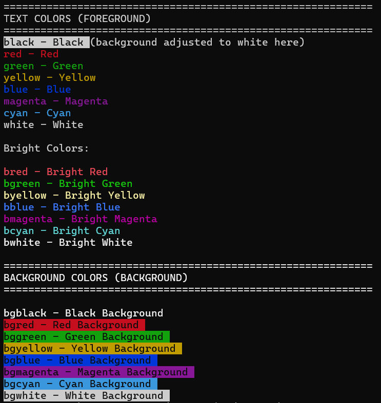
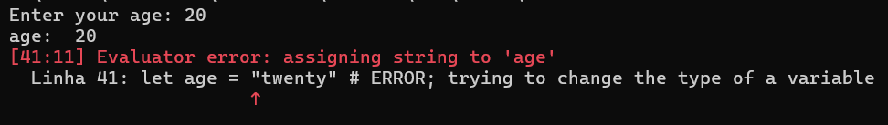

# <span style="font-size: 48px;">📚</span> User Manual Zzbasic v0.6.0

## Table of Contents

1. [Introduction](#1-introduction)
2. [Download and Installation](#2-download-and-installation)
3. [Getting Started](#3-getting-started)
4. [Variables and Data Types](#4-variables-and-data-types)
5. [Operators](#5-operators)
6. [LET Command](#6-let-command)
7. [PRINT Command](#7-print-command)
8. [INPUT Command](#8-input-command)
9. [Control Structures](#9-control-structures)
10. [Arrays](#10-arrays)
11. [Built-in Functions](#11-built-in-functions)
12. [Files](#12-files)
13. [Comments](#13-comments)
14. [Tips and Best Practices](#14-tips-and-best-practices)
15. [Troubleshooting](#15-troubleshooting)

---

## 1. Introduction

**What is Programming?**

Programming is the art of giving instructions to a computer. Just like you follow a recipe step by step, the computer follows the instructions you write, called **code**.

ZzBasic is a simple programming language. It allows you to write programs without worrying about complex technical details.

**Why learn to program?**

- **Solve problems** - Automate repetitive tasks
- **Create things** - Develop your own programs
- **Understand the world** - Understand how computers work
- **Opportunities** - Programming is a highly sought skill
- **Have fun** - Because programming is a lot of fun

**How to use this manual**

This manual is an introduction to programming using the ZzBasic language. Start at the beginning and follow step by step. Each concept is explained with practical examples. Don't skip sections!

---

## 2. Download and Installation

Currently ZzBasic has executables for Windows and Linux.

Gratitude to my dear student Gabriela, for having compiled and tested this version of ZzBasic on Mac.
<span style="font-size: 36px;">😊🙏</span>

You can download the executables and install them on your system by following the instructions on the<br>
[v0.6.0 Release page](https://github.com/zzbasic/zzbasic/releases/tag/v0.6.0)

---

## 3. Getting Started

### Interactive Mode (REPL)

The REPL (Read-Eval-Print Loop) is an interactive environment where you can type commands and see the result immediately.

To start:

```bash
zzbasic
```

You will see:

```
====================================
 ______    ____            _
|___  /   |  _ \          (_)
   / / ___| |_) | __ _ ___ _  ___
  / / |_  /  _ < / _` / __| |/ __|
 / /__ / /| |_) | (_| \__ \ | (__
/_____/___|____/ \__,_|___/_|\___|

v0.6.0 on Win32
====================================

Enter "help", a statement or "exit" to quit.

>>
```

Now you can type commands:

```
>> print "Hello, World!"
Hello, World!
>>
```

### File Mode (Script)

You can also create a `.zz` file with your programs.

Create a file called `hello.zz`:

```basic
print "Hello, World!" nl
```

Execute:

```bash
zzbasic hello.zz
```

**NOTE:** ZzBasic only accepts lines up to 128 characters. This forces you to organize your code better.

---

## 4. Variables and Data Types

### What is a variable?

A variable is a space in your computer's memory where you store a value. Think of a variable as a box with a label where you put something.

### Data Types

Currently ZzBasic has the following data types:

1. **Numbers** - Integer or decimal values
2. **Strings** - Text with maximum size of 128 characters
3. **Booleans** - Values true (`true`) or false (`false`)
4. **Text** - Strings larger than 128 characters 
5. **Arrays** - Lists of values

### Numbers

Numbers can be integers or decimals:

```basic
let integer = 42
let decimal = 3.14
let negative = -10
```

You can do mathematical operations:

```basic
let a = 10
let b = 3
let sum = a + b              # 13
let subtraction = a - b      # 7
let multiplication = a * b   # 30
let division = a / b         # 3.333...
```

### Strings

Strings are character strings with size up to 128 characters. Use double quotes to wrap a string:

```basic
let message = "Hello, World!"
let name = "John"
let empty = ""
```

To manipulate strings larger than 128 characters use the Text type.

### Booleans

Boolean is a data type that can only assume two values:

- `true` - true
- `false` - false

```basic
let true_val = true
let false_val = false
```

You can use logical operators with booleans:

```basic
let a = true
let b = false
let result1 = a and b  # false
let result2 = a or b   # true
let result3 = not a    # false
```

### Text

Text is a string type to be used with strings that have more than 128 characters:

```basic
let poem = load("poem.txt")
```

**NOTE:** In v0.6.0 the Text type can only be loaded from a file, displayed with `print` or saved to a file. In future versions we will have more functionality.

### Arrays

Arrays are lists of values. You will learn about arrays in section 10.

---

## 5. Operators

### Arithmetic Operators

| Operator | Description | Example | Result |
|----------|-----------|---------|-----------|
| `+` | Addition | `10 + 3` | 13 |
| `-` | Subtraction | `10 - 3` | 7 |
| `*` | Multiplication | `10 * 3` | 30 |
| `/` | Division | `10 / 3` | 3.333... |


### Comparison Operators

Comparison operators return `true` or `false`:

| Operator | Description | Example | Result |
|----------|-----------|---------|-----------|
| `==` | Equal | `10 == 10` | true |
| `!=` | Different | `10 != 5` | true |
| `<` | Less than | `5 < 10` | true |
| `>` | Greater than | `10 > 5` | true |
| `<=` | Less than or equal | `10 <= 10` | true |
| `>=` | Greater than or equal | `10 >= 5` | true |

### Logical Operators

| Operator | Description | Example | Result |
|----------|-----------|---------|-----------|
| `and` | Logical AND | `true and true` | true |
| `or` | Logical OR | `true or false` | true |
| `not` | Logical NOT | `not true` | false |

### Operator Precedence

Just like in mathematics, some operators have priority:

1. Parentheses `()`
2. Multiplication, Division `*`, `/`
3. Addition, Subtraction `+`, `-`
4. Comparison `<`, `>`, `==`, etc.
5. Logical `and`, `or`, `not`

Example:

```basic
let result = 2 + 3 * 4  # 14 (not 20)
let result2 = (2 + 3) * 4  # 20
```

---

## 6. LET Command

### What is it?

The `let` command creates a variable and assigns a value to it.

### What is it for?

Store values in your computer's memory to use later in the program.

### Syntax

```
let <variable_name> = <value>
```

### Rules for variable names

- Start with a letter or underscore: `_`
- Can contain letters, numbers and underscore
- Cannot be ZzBasic keywords
- Are case sensitive (`name` ≠ `Name`)
- Maximum size: 32 characters

ZzBasic keywords are:

```
and, as, bgblack, bgblue, bgcyan, bggreen, bgmagenta, bgred, bgwhite,
bgyellow, black, bblack, bblue, bcyan, bgreen, bmagenta, bred, bwhite,
byellow, break, center, continue, cyan, do, else, end, false, for,
from, green, if, import, input, left, let, load, magenta, nl, nocolor,
not, or, print, red, right, save, step, then, to, true, white, while,
width, yellow
```

### Examples

```basic
# Variable with number
let age = 25

# Variable with string
let name = "John"

# Variable with boolean
let active = true

# Variable with operation result
let result = 5 + 3 * 2
```

### Important

Once you assign a type to a variable, it cannot change type:

```basic
let x = 10          # x is a number
let x = "text"      # ERROR! x is already a number
```

---

## 7. PRINT Command

### What is it?

The `print` command displays text and variables on the screen.

### What is it for?

Show results, messages and values to the user.

### Basic Syntax

```
print <expression1> [<expression2> ...] [nl]
```

### Basic Examples

```basic
# Print text
print "Hello, World!" nl

# Print variable
let age = 25
print age nl

# Print multiple expressions
print "You are " age " years old" nl
```

### Line Break

Use `nl` to break a line:

```basic
print "Line 1" nl
print "Line 2" nl
print "Line 3" nl
```

If you use `print` alone, it skips a line:

```basic
print "First line" nl
print
print "Third line" nl
```

### Colors

Use colors to highlight text:

```basic
print red "Red text" nl
print green "Green text" nl
print blue "Blue text" nl
```

**Available colors:**

- `black` - Black
- `red` - Red
- `green` - Green
- `yellow` - Yellow
- `blue` - Blue
- `magenta` - Magenta
- `cyan` - Cyan
- `white` - White

**Bright colors:**

- `bred` - Bright red
- `bgreen` - Bright green
- `byellow` - Bright yellow
- `bblue` - Bright blue
- `bmagenta` - Bright magenta
- `bcyan` - Bright cyan
- `bwhite` - Bright white

### Background Colors

Use background colors to highlight even more:

```basic
print bgred "Red background" nl
print bggreen "Green background" nl
print bgblue "Blue background" nl
```

**Available background colors:**

- `bgblack`
- `bgred`
- `bggreen`
- `bgyellow`
- `bgblue`
- `bgmagenta`
- `bgcyan`
- `bgwhite`



### Disabling Colors

Use `nocolor` to disable colors:

```basic
print red "Red" nocolor " normal" nl
```

### Formatting - Width

Use `width()` to specify the field width:

```basic
print width(20) "Text" nl
```

This adds spaces to complete 20 characters.

### Formatting - Alignment

Use `left`, `right` or `center` for alignment:

```basic
print width(20) left "Left" nl
print width(20) right "Right" nl
print width(20) center "Center" nl
```

### Combining Everything - colors, width, and alignment

You can combine colors, width and alignment:

```basic
print bgyellow black width(40) left "bgyellow black width(40) left" nocolor nl
print bgwhite blue width(60) right "bgwhite blue width(60) right" nocolor nl
print bggreen white width(80) center "bggreen white width(80) center" nocolor nl
```


### Printing Arrays

Arrays can be printed directly:

```basic
let numbers = array(5)
push(numbers, 1)
push(numbers, 2)
push(numbers, 3)
print numbers nl  # Output: [1, 2, 3]
```

---

## 8. INPUT Command

### What is it?

The `input` command reads data typed by the user.

### What is it for?

Allow the user to provide information to the program.

### Syntax

```
input [<formatting>] "<prompt>" <variable>
```

### Basic Examples

```basic
# Simple input
input "Enter your name: " name
print "Hello, " name "!" nl

# Input for number
input "Enter your age: " age
print "You are " age " years old" nl
```

NOTE: input only accepts reading the value of one variable. If you try to read more than one variable in the same input statement, the interpreter will throw an error (in V0.6.0 nothing happens, this will be fixed in the future)

```basic
input number1 number2 # ERROR
print number1 nl
print number2 nl
```

### The `input` prompt accepts colors, `width` and alignment, similar to `print`

```basic
input green "Enter your name: " name

input red "Enter your password: " nocolor password

input width(50) "Enter: " text

input center width(40) "Question: " answer
```

### Automatic Type Detection

ZzBasic automatically detects the type:

```basic
input "Enter a number: " number  # Will be number
input "Enter text: " text        # Will be string
```

NOTE: After being created, a variable keeps its type until the end of the program. If you try to change the type of a variable, you will receive an error.

For example:

```
input "Enter your age: " age
print "age: " age nl

let age = "twenty" # ERROR; trying to change the type of a variable

print "age: " age nl
```

The output of this program will be:



---

## 9. Control Structures

### IF-THEN-ELSE Command

#### What is it?

The `if` command allows you to make decisions based on conditions.

#### What is it for?

Execute different code depending on a condition.

#### Syntax

```
# simple if
if (<condition>) then
    # code executed if <condition> is true
end if


# if...else
if (<condition>) then
    # code executed if <condition> is true
else
    # code executed if <condition> is false
end if
```

#### Simple Example

```basic
let age = 18

if (age >= 18) then
    print "You are of legal age" nl
end if
```

#### With else

```basic
let age = 15

if (age >= 18) then
    print "You are of legal age" nl
else
    print "You are underage" nl
end if
```

#### With multiple conditions

```basic
let grade = 7.5

if (grade >= 9) then
    print "Excellent!" nl
else
    if (grade >= 7) then
        print "Good!" nl
    else
        if (grade >= 5) then
            print "Passed" nl
        else
            print "Failed" nl
        end if
    end if
end if
```

Observe the code organization. Each `if`, `else` and `end if` are aligned vertically, indicating that they are part of the same branch. As new `if` branches are inserted they are shifted to the right, to show that they are inside the `if` above.

#### Important

**The condition MUST be between parentheses**


```basic
# CORRECT
if (x > 5) then
    print "x is greater than 5" nl
end if

# WRONG
if x > 5 then
    print "x is greater than 5" nl
end if
```

### WHILE Command

#### What is it?

The `while` command, also known as `while` loop, repeats a block of code while a condition is true.

#### What is it for?

Repeat code an indeterminate number of times.

#### Syntax

```
while (<condition>) do
    # code to repeat
end while
```

#### Example

```basic
let i = 0
while (i < 5) do
    print i nl
    let i = i + 1
end while
```

Output:
```
0
1
2
3
4
```

#### Practical Example

```basic
let password = ""
while (password != "1234") do
    input "Enter password: " password
end while
print "Access granted!" nl
```

#### Caution

If the condition never becomes false, the program will enter an infinite loop! An infinite loop means your program will keep executing the instructions inside the while loop indefinitely. To stop the program you must use CTRL + C.

### FOR Command

#### What is it?

The `for` command, `for` loop, repeats a block of code a specific number of times.

#### What is it for?

Repeat code when you know how many times you will repeat.

#### Basic Syntax

```
for <variable> = <start> to <end> [step <increment>] do
    # code to repeat
end for
```

The `step` is optional. If not passed, a value of 1 will be assumed.

#### Example

```basic
for i = 0 to 4 do
    print i nl
end for
```

Output:
```
0
1
2
3
4
```

#### With step (increment)

You can specify the increment:

```basic
for i = 0 to 10 step 2 do
    print i nl
end for
```

Output:
```
0
2
4
6
8
10
```

#### Decrementing

Use negative step:

```basic
for i = 10 to 0 step -1 do
    print i nl
end for
```

Output:
```
10
9
8
7
6
5
4
3
2
1
0
```

#### Practical Example

```basic
print "Times table of 5:" nl
for i = 1 to 10 do
    print "5 x" i " =" (5 * i) nl
end for
```

Output:

```
Times table of 5:
5 x 1  = 5
5 x 2  = 10
5 x 3  = 15
5 x 4  = 20
5 x 5  = 25
5 x 6  = 30
5 x 7  = 35
5 x 8  = 40
5 x 9  = 45
5 x 10  = 50
```

### BREAK Command

#### What is it?

The `break` command exits a loop immediately.

#### What is it for?

Stop the repetition when a condition is met.

#### Example

```basic
let i = 0
while (i < 10) do
    if (i == 5) then
        break
    end if
    print i nl
    let i = i + 1
end while
```

Output:
```
0
1
2
3
4
```

### CONTINUE Command

#### What is it?

The `continue` command jumps to the next iteration of the loop.

#### What is it for?

Skip code when a condition is met.

#### Example

```basic
let i = 0
while (i < 5) do
    let i = i + 1
    if (i == 3) then
        continue
    end if
    print i nl
end while
```

Output:
```
1
2
4
5
```

Note that when i equals 3, `continue` does not execute the instructions below, in this case displaying i, but jumps to the next value.

---

## 10. Arrays

### What is an array?

An array is a list of values. Each value has a position (index) starting from 0. 

**NOTE**: In v0.6.0 ZzBasic only has arrays of numbers.

Visual example:

```
Array: [10, 20, 30, 40, 50]
Index: 0   1   2   3   4
```

### Creating arrays

To create an array, use `array()`:

```basic
let numbers = array(5)
```

### Adding elements

To add an element at the end of the array use the `push` function:

```basic
let numbers = array(5)
push(numbers, 10)
push(numbers, 20)
push(numbers, 30)
push(numbers, 40)
push(numbers, 50)
```

### Accessing elements

Use brackets `[]` to access an element:

```basic
print numbers[0] nl  # 10
print numbers[1] nl  # 20
print numbers[2] nl  # 30
```

### Array size

Use `len()` to get the size:

```basic
print len(numbers) nl  # 5
```

### Removing elements

Use `pop()` to remove the last element from the array:

```basic
let last = pop(numbers)
print last nl  # 50
```

Use `remove()` to remove a specific element:

```basic
remove(numbers, 2)  # Remove the element at index 2, in this case 30
```

If you want to get a specific element use `get`:

```basic
let n = get(numbers, 1) # 20
```

### Checking if it is empty

Use `is_empty()`:

```basic
if (is_empty(numbers)) then
    print "Empty array" nl
else
    print "Array is not empty" nl
end if
```

### Practical Example

```basic
# Create array
let grades = array(10)

# Add grades
push(grades, 8.5)
push(grades, 9.0)
push(grades, 7.5)

# Display grades
print "Grades: " grades nl

# Calculate average
let sum = 0
let i = 0
while (i < len(grades)) do
    let sum = sum + grades[i]
    let i = i + 1
end while

let average = sum / len(grades)
print "Average: " average nl
print
```

---

## 11. Built-in Functions

### Array Functions

#### push()

Adds an element to the end of the array.

```basic
let arr = array(5)
push(arr, 42)
```

#### pop()

Removes and returns the last element from the array.

```basic
let arr = array(5)
push(arr, 10)
push(arr, 20)
push(arr, 30)
let last = pop(arr)  # last = 30
```

#### len()

Returns the number of elements in the array.

```basic
let arr = array(5)
push(arr, 10)
push(arr, 20)
push(arr, 30)
print len(arr)  # 3
```

#### get()

Gets an element at a specific index.

```basic
let arr = array(5)
push(arr, 10)
push(arr, 20)
push(arr, 30)
let n = get(arr, 1) # n = 20
```

#### set()

Sets an element at a specific index.

```basic
let arr = array(5)
push(arr, 10)
push(arr, 20)
push(arr, 30)
set(arr, 1, 50) # will replace the value 20 with 50
```

#### insert()

Inserts an element at a specific index.

```basic
let arr = array(5)
push(arr, 10)
push(arr, 20)
push(arr, 30)
print arr nl 
print
insert(arr, 1, 99) # will insert 99 in place of 20, pushing 20 forward
print arr nl
```

Output:

```
[10, 20, 30]

[10, 99, 20, 30]
```

#### remove()

Removes an element at a specific index.

```basic
let arr = array(5)
push(arr, 10)
push(arr, 20)
push(arr, 30)
push(arr, 40)
push(arr, 50)
remove(arr, 3) # remove 40
```

#### is_empty()

Checks if the array is empty.

```basic
let arr = array(5)
if (is_empty(arr)) then
    print "Empty array" nl
end if
```

### File Functions

#### load()

Loads the contents of a file as Text type.

```basic
let content = load("file.txt")
print content nl
```

#### save()

Saves content to a file.

```basic
let text = load("input.txt")
save text "output.txt"
```

---

## 12. Files

### Loading files

Use `load()` to load a file:

```basic
let content = load("file.txt")
print content nl
```

The variable `content` will be of Text type.

### Saving to file

Use `save()` to save to a file:

```basic
let text = load("input.txt")
save text "output.txt"
```

### Complete Example

```basic
# Load file
let original = load("input.txt")

# Display content
print "File contents:" nl
print original nl

# Save to another file
save original "backup.txt"
print "File saved!" nl
```

---

## 13. Comments

### What is it?

A comment is a line of code that the computer ignores. It serves to document your code.

### Syntax

Comments start with `#`:

```basic
# This is a comment
let x = 10  # This is also a comment
```

### What is it for?

Explain what your code does for you and for other people:

```basic
# Calculate the average of grades
let sum = 0
let i = 0
while (i < len(grades)) do
    let sum = sum + grades[i]
    let i = i + 1
end while

# Divide by the number of grades
let average = sum / len(grades)
print "Average: " average nl
```

---

## 14. Tips and Best Practices

### Use meaningful names

Use names that describe what the variable stores:

```basic
# CORRECT
let user_age = 25
let total_price = 100.50
let full_name = "John Silva"

# WRONG
let x = 25
let y = 100.50
let z = "John Silva"
```

### Organize your code

Use comments to document your code:

```basic
# Read user data
input "Enter your name: " name
input "Enter your age: " age

# Display data
print "Name: " name nl
print "Age: " age nl
```

### Respect the 128 character limit

Remember that each line has a limit of 128 characters:

```basic
# CORRECT (broken into multiple lines)
print "Name: " name nl
print "Age: " age nl

# WRONG (too long)
print "Name: " name " Age: " age " City: " city nl
```

### Use appropriate structures

- Use `for` when you know how many times you will repeat
- Use `while` when you don't know how many times you will repeat
- Use `if/else` for decisions

### Test your code

Always test your code with different values:

```basic
# Test with positive number
let number = 10
if (number > 0) then
    print "Positive" nl
end if

# Test with negative number
let number = -5
if (number > 0) then
    print "Positive" nl
end if
```

---

## 15. Troubleshooting

### Error: "Variable not defined"

You used a variable that was not created with `let`:

```basic
# WRONG
print name nl

# CORRECT
let name = "John"
print name nl
```

### Error: "Invalid syntax"

Check:
- Parentheses in `if`, `while`, `for`
- `end if`, `end while`, `end for` at the end
- Comments start with `#`

```basic
# WRONG
if age > 18 then
    print "Of legal age" nl
end

# CORRECT
if (age > 18) then
    print "Of legal age" nl
end if
```

### Error: "Line too long"

Break the line into smaller parts (maximum 128 characters):

```basic
# WRONG (too long)
print "Name: " name " Age: " age " Height: " height nl

# CORRECT
print "Name: " name nl
print "Age: " age nl
print "Height: " height nl
```

### Error: "Incompatible type"

You tried to assign a different type to a variable:

```basic
# WRONG
let x = 10
let x = "text"  # x is already a number!

# CORRECT
let x = 10
let y = "text"
```

### Error: "Index out of range"

You tried to access an index that doesn't exist in the array:

```basic
# WRONG
let arr = array(5)
push(arr, 10)
print arr[5] nl  # Only index 0 exists!

# CORRECT
let arr = array(5)
push(arr, 10)
print arr[0] nl
```

### Infinite Loop

If your program doesn't end, you may have an infinite loop:

```basic
# WRONG (infinite loop)
let i = 0
while (i < 10) do
    print i nl
    # Forgot to increment i!
end while

# CORRECT
let i = 0
while (i < 10) do
    print i nl
    let i = i + 1
end while
```

---

## Next Steps

Now that you know the basics:

1. Explore the examples [here](examples_0_6_0.md)
2. Create your own programs
3. Experiment with arrays and loops
4. Combine colors and formatting

Have fun programming!
