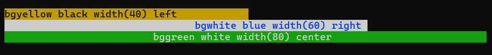
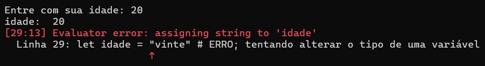

# <span style="font-size: 48px;">📚</span> Manual do Usuário Zzbasic v0.7.0

## Índice

1. [Introdução](#1-introdução)
2. [Download e Instalação](#2-download-e-instalação)
3. [Primeiros Passos](#3-primeiros-passos)
4. [Variáveis e Tipos de Dados](#4-variáveis-e-tipos-de-dados)
5. [Operadores](#5-operadores)
6. [Comando LET](#6-comando-let)
7. [Comando PRINT](#7-comando-print)
8. [Comando INPUT](#8-comando-input)
9. [Estruturas de Controle](#9-estruturas-de-controle)
10. [Arrays](#10-arrays)
11. [Funções Built-in](#11-funções-built-in)
12. [Arquivos](#12-arquivos)
13. [Comentários](#13-comentários)
14. [Dicas e Boas Práticas](#14-dicas-e-boas-práticas)
15. [Resolução de Problemas](#15-resolução-de-problemas)

---

## 1. Introdução

**O que é Programação?**

Programação é a arte de dar instruções a um computador. Assim como você segue uma receita de bolo passo a passo, o computador segue as instruções que você escreve, chamadas de **código**.

ZzBasic é uma linguagem de programação simples. Ela permite que você escreva programas sem se preocupar com detalhes técnicos complexos.

**Por que aprender a programar?**

- **Resolver problemas** - Automatizar tarefas repetitivas
- **Criar coisas** - Desenvolver seus próprios programas
- **Entender o mundo** - Compreender como os computadores funcionam
- **Oportunidades** - Programação é uma habilidade muito procurada
- **Se divertir** - Porque programar é muito divertido

**Como usar este manual**

Este manual é uma introdução a programação usando a linguagem ZzBasic. Comece pelo início e siga passo a passo. Cada conceito é explicado com exemplos práticos. Não pule seções!

---

## 2. Download e Instalação

Atualmente o ZzBasic tem executáveis para Windows e Linux. 

Você pode baixar os executáveis e instalar em seu sistema seguindo as instruções na [página de Release da v0.6.0](https://github.com/zzbasic/zzbasic/releases/tag/v0.6.0)

---

## 3. Primeiros Passos

### Modo Interativo (REPL)

O REPL (Read-Eval-Print Loop) é um ambiente interativo onde você pode digitar comandos e ver o resultado imediatamente.

Para iniciar:

```bash
zzbasic
```

Você verá:

```
====================================
 ______    ____            _
|___  /   |  _ \          (_)
   / / ___| |_) | __ _ ___ _  ___
  / / |_  /  _ < / _` / __| |/ __|
 / /__ / /| |_) | (_| \__ \ | (__
/_____/___|____/ \__,_|___/_|\___|

v0.6.0 on Win32
====================================

Enter "help", a statement or "exit" to quit.

>>
```

Agora você pode digitar comandos:

```
>> print "Olá, Mundo!"
Olá, Mundo!
>>
```

### Modo Arquivo (Script)

Você também pode criar um arquivo `.zz` com seus programas.

Crie um arquivo chamado `hello.zz`:

```basic
print "Olá, Mundo!" nl
```

Execute:

```bash
zzbasic hello.zz
```

**OBSERVAÇÃO:** O ZzBasic só aceita linhas de até 128 caracteres. Isto lhe obriga a organizar melhor seu código.

---

## 4. Variáveis e Tipos de Dados

### O que é uma variável?

Uma variável é um espaço na memória do computador onde você guarda um valor. Pense em uma variável como uma caixa com um rótulo onde você vai colocar alguma coisa.

### Tipos de Dados

Atualmente o ZzBasic tem os seguintes tipos de dados:

1. **Números** - Valores inteiros ou decimais
2. **Strings** - Texto com tamanho máximo de 128 caracteres
3. **Booleanos** - Valores verdadeiro (`true`) ou falso (`false`)
4. **Text** - Strings maiores que 128 caracteres 
5. **Arrays** - Listas de valores

### Números

Números podem ser inteiros ou decimais:

```basic
let inteiro = 42
let decimal = 3.14
let negativo = -10
```

Você pode fazer operações matemáticas:

```basic
let a = 10
let b = 3
let soma = a + b              # 13
let subtracao = a - b         # 7
let multiplicacao = a * b     # 30
let divisao = a / b           # 3.333...
```

### Strings

Strings são cadeias de caracteres com tamanho até 128 caracteres. Use aspas duplas para envolver uma string:

```basic
let mensagem = "Olá, Mundo!"
let nome = "João"
let vazio = ""
```

Para manipular strings maiores que 128 caracteres use o tipo Text.

### Booleanos

Booleano é um tipo de dado que só pode assumir dois valores:

- `true` - verdadeiro
- `false` - falso

```basic
let verdadeiro = true
let falso = false
```

Você pode usar operadores lógicos com os booleanos:

```basic
let a = true
let b = false
let resultado1 = a and b  # false
let resultado2 = a or b   # true
let resultado3 = not a    # false
```

### Text

Text é um tipo string para ser usado com strings que tenham mais de 128 caracteres:

```basic
let poema = load("poema.txt")
```

**OBSERVAÇÃO:** Na v0.6.0 o tipo Text só pode ser carregado de um arquivo, exibido com `print` ou salvo em um arquivo. Em versões futuras teremos mais funcionalidades.

### Arrays

Arrays são listas de valores. Você aprenderá sobre arrays na seção 10.

---

## 5. Operadores

### Operadores Aritméticos

| Operador | Descrição | Exemplo | Resultado |
|----------|-----------|---------|-----------|
| `+` | Adição | `10 + 3` | 13 |
| `-` | Subtração | `10 - 3` | 7 |
| `*` | Multiplicação | `10 * 3` | 30 |
| `/` | Divisão | `10 / 3` | 3.333... |


### Operadores de Comparação

Operadores de comparação retornam `true` ou `false`:

| Operador | Descrição | Exemplo | Resultado |
|----------|-----------|---------|-----------|
| `==` | Igual | `10 == 10` | true |
| `!=` | Diferente | `10 != 5` | true |
| `<` | Menor | `5 < 10` | true |
| `>` | Maior | `10 > 5` | true |
| `<=` | Menor ou igual | `10 <= 10` | true |
| `>=` | Maior ou igual | `10 >= 5` | true |

### Operadores Lógicos

| Operador | Descrição | Exemplo | Resultado |
|----------|-----------|---------|-----------|
| `and` | E lógico | `true and true` | true |
| `or` | OU lógico | `true or false` | true |
| `not` | NÃO lógico | `not true` | false |

### Precedência de Operadores

Assim como na matemática, alguns operadores têm prioridade:

1. Parênteses `()`
2. Multiplicação, Divisão `*`, `/`
3. Adição, Subtração `+`, `-`
4. Comparação `<`, `>`, `==`, etc.
5. Lógico `and`, `or`, `not`

Exemplo:

```basic
let resultado = 2 + 3 * 4  # 14 (não 20)
let resultado2 = (2 + 3) * 4  # 20
```

---

## 6. Comando LET

### O que é?

O comando `let` cria uma variável e atribui um valor a ela.

### Para que serve?

Guardar valores na memória do computador para usar depois no programa.

### Sintaxe

```
let <nome_variavel> = <valor>
```

### Regras para nomes de variáveis

- Começam com letra ou underscore (sublinhado): `_`
- Podem conter letras, números e underscore
- Não podem ser palavras-chave da linguagem ZzBasic
- São sensíveis a maiúsculas/minúsculas (`nome` ≠ `Nome`)
- Tamanho máximo: 32 caracteres

As palavras-chave do ZzBasic são:

```
and, as, bgblack, bgblue, bgcyan, bggreen, bgmagenta, bgred, bgwhite,
bgyellow, black, bblack, bblue, bcyan, bgreen, bmagenta, bred, bwhite,
byellow, break, center, continue, cyan, do, else, end, false, for,
from, green, if, import, input, left, let, load, magenta, nl, nocolor,
not, or, print, red, right, save, step, then, to, true, white, while,
width, yellow
```

### Exemplos

```basic
# Variável com número
let idade = 25

# Variável com string
let nome = "João"

# Variável com booleano
let ativo = true

# Variável com resultado de operação
let resultado = 5 + 3 * 2
```

### Importante

Uma vez que você atribui um tipo a uma variável, ela não pode mudar de tipo:

```basic
let x = 10          # x é número
let x = "texto"     # ERRO! x já é número
```

---

## 7. Comando PRINT

### O que é?

O comando `print` exibe texto e variáveis na tela.

### Para que serve?

Mostrar resultados, mensagens e valores para o usuário.

### Sintaxe Básica

```
print <expressão1> [<expressão2> ...] [nl]
```

### Exemplos Básicos

```basic
# Imprimir texto
print "Olá, Mundo!" nl

# Imprimir variável
let idade = 25
print idade nl

# Imprimir múltiplas expressões
print "Você tem " idade " anos" nl
```

### Quebra de Linha

Use `nl` para quebrar linha:

```basic
print "Linha 1" nl
print "Linha 2" nl
print "Linha 3" nl
```

Se usar `print` sozinho, ele pula uma linha:

```basic
print "Primeira linha" nl
print
print "Terceira linha" nl
```

### Cores

Use cores para destacar texto:

```basic
print red "Texto vermelho" nl
print green "Texto verde" nl
print blue "Texto azul" nl
```

**Cores disponíveis:**

- `black` - Preto
- `red` - Vermelho
- `green` - Verde
- `yellow` - Amarelo
- `blue` - Azul
- `magenta` - Magenta
- `cyan` - Ciano
- `white` - Branco

**Cores brilhantes:**

- `bred` - Vermelho brilhante
- `bgreen` - Verde brilhante
- `byellow` - Amarelo brilhante
- `bblue` - Azul brilhante
- `bmagenta` - Magenta brilhante
- `bcyan` - Ciano brilhante
- `bwhite` - Branco brilhante

### Cores de Fundo

Use cores de fundo para destacar ainda mais:

```basic
print bgred "Fundo vermelho" nl
print bggreen "Fundo verde" nl
print bgblue "Fundo azul" nl
```

**Cores de fundo disponíveis:**

- `bgblack`
- `bgred`
- `bggreen`
- `bgyellow`
- `bgblue`
- `bgmagenta`
- `bgcyan`-
- `bgwhite`


### Desativando Cores

Use `nocolor` para desativar cores:

```basic
print red "Vermelho" nocolor " normal" nl
```

### Formatação - Largura

Use `width()` para especificar a largura do campo:

```basic
print width(20) "Texto" nl
```

Isto adiciona espaços para completar 20 caracteres.

### Formatação - Alinhamento

Use `left`, `right` ou `center` para alinhamento:

```basic
print width(20) left "Esquerda" nl
print width(20) right "Direita" nl
print width(20) center "Centro" nl
```

### Combinando Tudo - cores, width, e alinhamento

Você pode combinar cores, largura e alinhamento:

```basic
print bgyellow black width(40) left "bgyellow black width(40) left" nocolor nl
print bgwhite blue width(60) right "bgwhite blue width(60) right" nocolor nl
print bggreen white width(80) center "bggreen white width(80) center" nocolor nl
```



### Imprimindo Arrays

Arrays podem ser impressos diretamente:

```basic
let numeros = array(5)
push(numeros, 1)
push(numeros, 2)
push(numeros, 3)
print numeros nl  # Output: [1, 2, 3]
```

---

## 8. Comando INPUT

### O que é?

O comando `input` lê dados digitados pelo usuário.

### Para que serve?

Permitir que o usuário forneça informações ao programa.

### Sintaxe

```
input [<formatação>] "<prompt>" <variável>
```

### Exemplos Básicos

```basic
# Input simples
input "Digite seu nome: " nome
print "Olá, " nome "!" nl

# Input para número
input "Digite sua idade: " idade
print "Você tem " idade " anos" nl
```

**OBERVAÇÃO**: `input` só aceita ler o valor de uma variável. Se você tentar ler mais de uma variável no mesmo `input` o interpretador emitirá um erro(na V0.6.0 nada acontece, isso será corrigido no futuro)

```basic
input numero1 numero2 # ERRO
print numero1 nl
print numero2 nl
```

### O prompt do `input` aceita cores, `width` e alinhamento, similar ao `print`

```basic
input green "Digite seu nome: " nome

input red "Digite sua senha: " nocolor senha

input width(50) "Digite: " texto

input center width(40) "Pergunta: " resposta
```

### Detecção Automática de Tipo

O ZzBasic detecta automaticamente o tipo:

```basic
input "Digite um número: " numero  # Será número
input "Digite texto: " texto       # Será string
```
OBSERVAÇÃO: Após ser criada, uma variável fica com seu tipo até o fim do programa. Se você tentar mudar o tipo da 
variável, recebérá um erro.

Por exemplo:

```
input "Entre com sua idade: " idade
print "idade: " idade nl

let idade = "vinte" # ERRO; tentando alterar o tipo de uma variável

print "idade: " idade nl
```

A saída desse programa será:



---

## 9. Estruturas de Controle

### Comando IF-THEN-ELSE

#### O que é?

O comando `if` permite tomar decisões baseadas em condições.

#### Para que serve?

Executar código diferente dependendo de uma condição.

#### Sintaxe

```
# if simples
if (<condição>) then
    # código executado se <condição> for true (verdadeiro)
end if


# if...else
if (<condição>) then
    # código executado se <condição> for true (verdadeiro)
else
    # código executado se <condição> for false (falso)
end if
```

#### Exemplo Simples

```basic
let idade = 18

if (idade >= 18) then
    print "Você é maior de idade" nl
end if
```

#### Com else

```basic
let idade = 15

if (idade >= 18) then
    print "Você é maior de idade" nl
else
    print "Você é menor de idade" nl
end if
```

#### Com múltiplas condições

```basic
let nota = 7.5

if (nota >= 9) then
    print "Excelente!" nl
else
    if (nota >= 7) then
        print "Bom!" nl
    else
        if (nota >= 5) then
            print "Passou" nl
        else
            print "Reprovou" nl
        end if
    end if
end if
```

Observe a organização do código. Cada `if`, `else` e `end if` estão alinhados verticalmente, indicando que fazem parte de um mesmo ramo. A medida que novos ramos de `if` são inseridos eles são deslocados para direita, para mostrar que estão dentro do `if` mais acima.

#### Importante

**A condição DEVE estar entre parênteses**


```basic
# CORRETO
if (x > 5) then
    print "x é maior que 5" nl
end if

# ERRADO
if x > 5 then
    print "x é maior que 5" nl
end if
```

### Comando WHILE

#### O que é?

O comando `while` , mais conhecido como loop (laço) `while`, repete um bloco de código enquanto uma condição for verdadeira.

#### Para que serve?

Repetir código um número indeterminado de vezes.

#### Sintaxe

```
while (<condição>) do
    # código a repetir
end while
```

#### Exemplo

```basic
let i = 0
while (i < 5) do
    print i nl
    let i = i + 1
end while
```

Output:
```
0
1
2
3
4
```

#### Exemplo Prático

```basic
let senha = ""
while (senha != "1234") do
    input "Digite a senha: " senha
end while
print "Acesso concedido!" nl
```

#### Cuidado

Se a condição nunca ficar falsa, o programa ficará em loop infinito! Loop infinito significa que seu programa ficará executando as instruções dentro do loop `while` indefinidamente, para parar o programa você deverá usar CTRL + C. 

### Comando FOR

#### O que é?

O comando `for`, loop `for`,  repete um bloco de código um número específico de vezes.

#### Para que serve?

Repetir código quando você sabe quantas vezes vai repetir.

#### Sintaxe Básica

```
for <variável> = <início> to <fim> [step <incremento>] do
    # código a repetir
end for
```

O `step` é opcional. Se não for passado, será assumido do valor 1.

#### Exemplo

```basic
for i = 0 to 4 do
    print i nl
end for
```

Output:
```
0
1
2
3
4
```

#### Com step (passo)

Você pode especificar o incremento:

```basic
for i = 0 to 10 step 2 do
    print i nl
end for
```

Output:
```
0
2
4
6
8
10
```

#### Decrementando

Use step negativo:

```basic
for i = 10 to 0 step -1 do
    print i nl
end for
```

Output:
```
10
9
8
7
6
5
4
3
2
1
0
```

#### Exemplo Prático

```basic
print "Tabuada do 5:" nl
for i = 1 to 10 do
    print "5 x" i " =" (5 * i) nl
end for
```

Output:

```
Tabuada do 5:
5 x 1  = 5
5 x 2  = 10
5 x 3  = 15
5 x 4  = 20
5 x 5  = 25
5 x 6  = 30
5 x 7  = 35
5 x 8  = 40
5 x 9  = 45
5 x 10  = 50
```

### Comando BREAK

#### O que é?

O comando `break` sai de um loop imediatamente.

#### Para que serve?

Parar a repetição quando uma condição é atendida.

#### Exemplo

```basic
let i = 0
while (i < 10) do
    if (i == 5) then
        break
    end if
    print i nl
    let i = i + 1
end while
```

Output:
```
0
1
2
3
4
```

### Comando CONTINUE

#### O que é?

O comando `continue` pula para a próxima iteração do loop.

#### Para que serve?

Pular código quando uma condição é atendida.

#### Exemplo

```basic
let i = 0
while (i < 5) do
    let i = i + 1
    if (i == 3) then
        continue
    end if
    print i nl
end while
```

Output:
```
1
2
4
5
```

Note que quando i é igual a 3, o `continue` não executa as instruções abaixo, no caso exibir i,  mas pula para o próximo valor.

---

## 10. Arrays

### O que é um array?

Um array é uma lista de valores. Cada valor tem uma posição (índice) começando do 0. 

**OBSERVAÇÃO**: Na v0.6.0 ZzBasic só possui arrays de números.

Exemplo visual:

```
Array: [10, 20, 30, 40, 50]
Índice: 0   1   2   3   4
```

### Criando arrays

Para criar um array, use `array()`:

```basic
let numeros = array(5)
```

### Adicionando elementos

Para adicionar um elemento no fim do array use a função `push`:

```basic
let numeros = array(5)
push(numeros, 10)
push(numeros, 20)
push(numeros, 30)
push(numeros, 40)
push(numeros, 50)
```

### Acessando elementos

Use colchetes `[]` para acessar um elemento:

```basic
print numeros[0] nl  # 10
print numeros[1] nl  # 20
print numeros[2] nl  # 30
```

### Tamanho do array

Use `len()` para obter o tamanho:

```basic
print len(numeros) nl  # 5
```

### Removendo elementos

Use `pop()` para remover o último elemento do array:

```basic
let ultimo = pop(numeros)
print ultimo nl  # 50
```

Use `remove()` para remover um elemento específico:

```basic
remove(numeros, 2)  # Remove o elemento no índice 2, no caso o 30
```

Se quiser pegar um elemento específico use `get`:

```basic
let n = get(numeros, 1) # 20
```

### Verificando se está vazio

Use `is_empty()`:

```basic
if (is_empty(numeros)) then
    print "Array vazio" nl
else
    print "Array não está vazio" nl
end if
```

### Exemplo Prático

```basic
# Criar array
let notas = array(10)

# Adicionar notas
push(notas, 8.5)
push(notas, 9.0)
push(notas, 7.5)

# Exibir notas
print "Notas: " notas nl

# Calcular média
let soma = 0
let i = 0
while (i < len(notas)) do
    let soma = soma + notas[i]
    let i = i + 1
end while

let media = soma / len(notas)
print "Média: " media nl
print
```

---

## 11. Funções Built-in

### Funções de Array

#### push()

Adiciona um elemento ao final do array.

```basic
let arr = array(5)
push(arr, 42)
```

#### pop()

Remove e retorna o último elemento do array.

```basic
let arr = array(5)
push(arr, 10)
push(arr, 20)
push(arr, 30)
let ultimo = pop(arr)  # ultimo = 30
```

#### len()

Retorna o número de elementos no array.

```basic
let arr = array(5)
push(arr, 10)
push(arr, 20)
push(arr, 30)
print len(arr)  # 3
```

#### get()

Obtém um elemento em um índice específico.

```basic
let arr = array(5)
push(arr, 10)
push(arr, 20)
push(arr, 30)
let n = get(arr, 1) # n = 20
```

#### set()

Define um elemento em um índice específico.

```basic
let arr = array(5)
push(arr, 10)
push(arr, 20)
push(arr, 30)
set(arr, 1, 50) # substituira o valor 20 por 50
```

#### insert()

Insere um elemento em um índice específico.

```basic
let arr = array(5)
push(arr, 10)
push(arr, 20)
push(arr, 30)
print arr nl 
print
insert(arr, 1, 99) # vai inserir 99 no lugar de 20, empurrando 20 para a frente
print arr nl
```

Output:

```
[10, 20, 30]

[10, 99, 20, 30]
```
#### remove()

Remove um elemento em um índice específico.

```basic
let arr = array(5)
push(arr, 10)
push(arr, 20)
push(arr, 30)
push(arr, 40)
push(arr, 50)
remove(arr, 3) # remove 40
```

#### is_empty()

Verifica se o array está vazio.

```basic
let arr = array(5)
if (is_empty(arr)) then
    print "Array vazio" nl
end if
```

### Funções de Arquivo

#### load()

Carrega o conteúdo de um arquivo como tipo Text.

```basic
let conteudo = load("arquivo.txt")
print conteudo nl
```

#### save()

Salva conteúdo em um arquivo.

```basic
let texto = load("entrada.txt")
save texto "saida.txt"
```

---

## 12. Arquivos

### Carregando arquivos

Use `load()` para carregar um arquivo:

```basic
let conteudo = load("arquivo.txt")
print conteudo nl
```

A variável `conteudo` será do tipo Text.

### Salvando em arquivo

Use `save()` para salvar em arquivo:

```basic
let texto = load("entrada.txt")
save texto "saida.txt"
```

### Exemplo Completo

```basic
# Carregar arquivo
let original = load("entrada.txt")

# Exibir conteúdo
print "Conteúdo do arquivo:" nl
print original nl

# Salvar em outro arquivo
save original "backup.txt"
print "Arquivo salvo!" nl
```

---

## 13. Comentários

### O que é?

Um comentário é uma linha de código que o computador ignora. Serve para documentar seu código.

### Sintaxe

Comentários começam com `#`:

```basic
# Isto é um comentário
let x = 10  # Isto também é um comentário
```

### Para que serve?

Explicar o que seu código faz para você e para outras pessoas:

```basic
# Calcular a média de notas
let soma = 0
let i = 0
while (i < len(notas)) do
    let soma = soma + notas[i]
    let i = i + 1
end while

# Dividir pela quantidade de notas
let media = soma / len(notas)
print "Média: " media nl
```

---

## 14. Dicas e Boas Práticas

### Use nomes significativos

Use nomes que descrevem o que a variável armazena:

```basic
# CORRETO
let idade_usuario = 25
let preco_total = 100.50
let nome_completo = "João Silva"

# ERRADO
let x = 25
let y = 100.50
let z = "João Silva"
```

### Organize seu código

Use comentários para documentar seu código:

```basic
# Ler dados do usuário
input "Digite seu nome: " nome
input "Digite sua idade: " idade

# Exibir dados
print "Nome: " nome nl
print "Idade: " idade nl
```

### Respeite o limite de 128 caracteres

Lembre-se que cada linha tem limite de 128 caracteres:

```basic
# CORRETO (quebrado em múltiplas linhas)
print "Nome: " nome nl
print "Idade: " idade nl

# ERRADO (muito longo)
print "Nome: " nome " Idade: " idade " Cidade: " cidade nl
```

### Use estruturas apropriadas

- Use `for` quando sabe quantas vezes vai repetir
- Use `while` quando não sabe quantas vezes vai repetir
- Use `if/else` para decisões

### Teste seu código

Sempre teste seu código com diferentes valores:

```basic
# Teste com número positivo
let numero = 10
if (numero > 0) then
    print "Positivo" nl
end if

# Teste com número negativo
let numero = -5
if (numero > 0) then
    print "Positivo" nl
end if
```

---

## 15. Resolução de Problemas

### Erro: "Variável não definida"

Você usou uma variável que não foi criada com `let`:

```basic
# ERRADO
print nome nl

# CORRETO
let nome = "João"
print nome nl
```

### Erro: "Sintaxe inválida"

Verifique:
- Parênteses em `if`, `while`, `for`
- `end if`, `end while`, `end for` no final
- Comentários começam com `#`

```basic
# ERRADO
if idade > 18 then
    print "Maior de idade" nl
end

# CORRETO
if (idade > 18) then
    print "Maior de idade" nl
end if
```

### Erro: "Linha muito longa"

Quebre a linha em partes menores (máximo 128 caracteres):

```basic
# ERRADO (muito longo)
print "Nome: " nome " Idade: " idade " Altura: " altura nl

# CORRETO
print "Nome: " nome nl
print "Idade: " idade nl
print "Altura: " altura nl
```

### Erro: "Tipo incompatível"

Você tentou atribuir um tipo diferente a uma variável:

```basic
# ERRADO
let x = 10
let x = "texto"  # x já é número!

# CORRETO
let x = 10
let y = "texto"
```

### Erro: "Índice fora do intervalo"

Você tentou acessar um índice que não existe no array:

```basic
# ERRADO
let arr = array(5)
push(arr, 10)
print arr[5] nl  # Só existe índice 0!

# CORRETO
let arr = array(5)
push(arr, 10)
print arr[0] nl
```

### Loop Infinito

Se seu programa não termina, você pode ter um loop infinito:

```basic
# ERRADO (loop infinito)
let i = 0
while (i < 10) do
    print i nl
    # Faltou incrementar i!
end while

# CORRETO
let i = 0
while (i < 10) do
    print i nl
    let i = i + 1
end while
```

---

## Próximos Passos

Agora que você conhece o básico:

1. Explore os exemplos [aqui](exemplos_0_6_0.md)
2. Crie seus próprios programas
3. Experimente com arrays e loops
4. Combine cores e formatação

Divirta-se programando!
