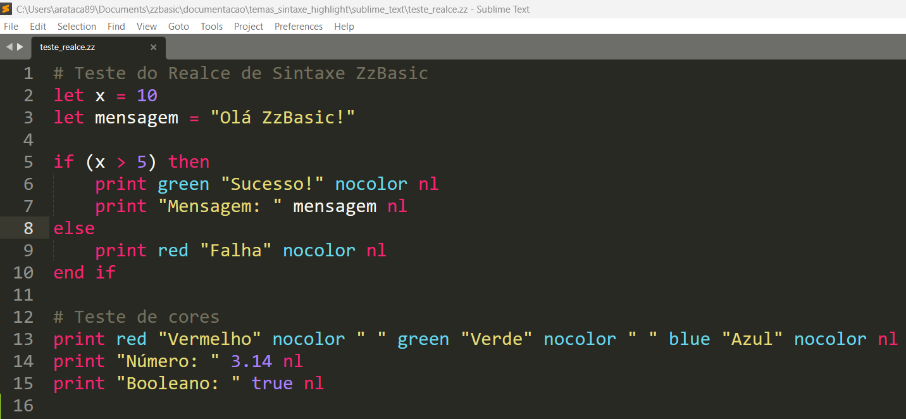

# Realce de Sintaxe ZzBasic para Sublime Text


Realce de sintaxe completo e tema de cores para a **linguagem de programação ZzBasic** no Sublime Text.

## 📦 Arquivos Incluídos

| Arquivo | Descrição |
|---------|-----------|
| [ZzBasic.tmLanguage](https://github.com/zzbasic/zzbasic/blob/main/editor-support/sublime-text/ZzBasic.tmLanguage) | Definição de sintaxe para a linguagem ZzBasic |
| [ZzBasic Monokai.sublime-color-scheme](https://github.com/zzbasic/zzbasic/blob/main/editor-support/sublime-text/ZzBasic%20Monokai.sublime-color-scheme) | Tema de cores Monokai opcional |

## 🚀 Instalação

### **Windows**

#### Método 1: Usando a Pasta de Pacotes (Recomendado)
1. **Abra o Sublime Text**
2. Pressione `Ctrl+Shift+P` para abrir a Paleta de Comandos
3. Digite `Browse Packages` e selecione essa opção
4. Navegue até a pasta `User`
5. **Crie uma nova pasta** chamada `ZzBasic`
6. Copie o arquivo `ZzBasic.tmLanguage` para dentro da pasta `ZzBasic`
7. (Opcional) Copie `ZzBasic Monokai.sublime-color-scheme` para a pasta `User`
8. **Reinicie o Sublime Text**

#### Método 2: Caminho Manual
```cmd
# Abra o Prompt de Comando ou PowerShell
cd %APPDATA%\Sublime Text\Packages\User
mkdir ZzBasic
copy C:\caminho\para\ZzBasic.tmLanguage ZzBasic\
```

#### Método 3: Atalho Rápido
- Pressione `Win+R`, digite: `%APPDATA%\Sublime Text\Packages\User`
- Crie a pasta `ZzBasic` e cole os arquivos dentro

### **Linux**

#### Método 1: Usando a Pasta de Pacotes
1. **Abra o Sublime Text**
2. Pressione `Ctrl+Shift+P` para abrir a Paleta de Comandos
3. Digite `Browse Packages` e selecione essa opção
4. Navegue até a pasta `User`
5. **Crie uma nova pasta** chamada `ZzBasic`
6. Copie o arquivo `ZzBasic.tmLanguage` para dentro da pasta `ZzBasic`
7. (Opcional) Copie `ZzBasic Monokai.sublime-color-scheme` para a pasta `User`
8. **Reinicie o Sublime Text**

#### Método 2: Comandos no Terminal
```bash
# Crie o diretório
mkdir -p ~/.config/sublime-text/Packages/User/ZzBasic

# Copie o arquivo de sintaxe
cp ZzBasic.tmLanguage ~/.config/sublime-text/Packages/User/ZzBasic/

# Opcional: Copie o tema de cores
cp "ZzBasic Monokai.sublime-color-scheme" ~/.config/sublime-text/Packages/User/
```

#### Para Sublime Text 3 (algumas distribuições):
```bash
mkdir -p ~/.config/sublime-text-3/Packages/User/ZzBasic
cp ZzBasic.tmLanguage ~/.config/sublime-text-3/Packages/User/ZzBasic/
```

### **macOS**
```bash
# Crie o diretório
mkdir -p ~/Library/Application\ Support/Sublime\ Text/Packages/User/ZzBasic

# Copie o arquivo de sintaxe
cp ZzBasic.tmLanguage ~/Library/Application\ Support/Sublime\ Text/Packages/User/ZzBasic/

# Opcional: Copie o tema de cores
cp "ZzBasic Monokai.sublime-color-scheme" ~/Library/Application\ Support/Sublime\ Text/Packages/User/
```

## 🎨 Aplicando o Tema de Cores (Opcional)

Para usar o tema ZzBasic Monokai:

1. **Abra o Sublime Text**
2. Vá em: `Preferences` → `Color Scheme` (Preferências → Esquema de Cores)
3. Selecione: `User` → `ZzBasic Monokai`
4. O tema será aplicado imediatamente

**Nota:** O tema é apenas estético. A sintaxe funciona com qualquer tema escuro.

## ✅ Verificação da Instalação

Para verificar se a instalação foi bem-sucedida:

1. Abra ou crie um arquivo com extensão `.zz`
2. Olhe no canto inferior direito do Sublime Text
3. Deve aparecer **"ZzBasic"**
4. Se não aparecer, selecione manualmente: `View` → `Syntax` → `User` → `ZzBasic`

### Código de Teste
Crie um arquivo `teste_realce.zz`:
```ZzBasic
# Teste do Realce de Sintaxe ZzBasic
let x = 10
let mensagem = "Olá ZzBasic!"

if (x > 5) then
    print green "Sucesso!" nocolor nl
    print "Mensagem: " mensagem nl
else
    print red "Falha" nocolor nl
end if

# Teste de cores
print red "Vermelho" nocolor " " green "Verde" nocolor " " blue "Azul" nocolor nl
print "Número: " 3.14 nl
print "Booleano: " true nl
```

### Como deve aparecer no Sublime Text



## 🛠️ Solução de Problemas

### **A sintaxe não está sendo aplicada**
1. Verifique se o arquivo tem extensão `.zz` 
2. Reinicie o Sublime Text
3. Force a sintaxe manualmente: `View` → `Syntax` → `User` → `ZzBasic`

### **As cores estão diferentes do esperado**
1. O tema Monokai é opcional
2. Você pode usar qualquer tema escuro do Sublime Text
3. Para remover o tema Monokai, delete o arquivo `ZzBasic Monokai.sublime-color-scheme`

### **Não consigo encontrar a pasta Packages**
- **Windows:** `%APPDATA%\Sublime Text\Packages\User`
- **Linux:** `~/.config/sublime-text/Packages/User`
- **macOS:** `~/Library/Application Support/Sublime Text/Packages/User`

## 📋 Comandos Suportados

A sintaxe reconhece todos os comandos do ZzBasic v0.5.2:

### Palavras-chave
- `if`, `then`, `else`, `end`, `and`, `or`, `not`

### Comandos
- `let`, `print`, `input`, `nl`

### Comandos do REPL
- `exit`, `quit`, `help`, `vars`, `reset`, `clear`, `tokens`, `ast`, `symbols`

### Cores
- Normais: `black`, `red`, `green`, `yellow`, `blue`, `magenta`, `cyan`, `white`
- Brilhantes: `bblack`, `bred`, `bgreen`, `byellow`, `bblue`, `bmagenta`, `bcyan`, `bwhite`
- Fundo: `bgblack`, `bgred`, `bggreen`, `bgyellow`, `bgblue`, `bgmagenta`, `bgcyan`, `bgwhite`
- Especial: `nocolor`

### Formatação
- `width`, `left`, `right`, `center`

### Valores
- Booleanos: `true`, `false`
- Números: `123`, `3.14`
- Strings: `"texto entre aspas"`

### Operadores
- Aritméticos: `+`, `-`, `*`, `/`
- Comparação: `==`, `!=`, `<`, `>`, `<=`, `>=`
- Atribuição: `=`
- Lógicos: `!`

## 🔄 Atualização

Para atualizar para uma nova versão:

1. Delete o arquivo antigo `ZzBasic.tmLanguage`
2. Copie o novo arquivo para a mesma pasta
3. Reinicie o Sublime Text

## 🗑️ Desinstalação

Para remover completamente:

1. Delete a pasta `ZzBasic` dentro de `Packages/User`
2. Delete o arquivo `ZzBasic Monokai.sublime-color-scheme` (se aplicável)
3. Reinicie o Sublime Text

## 🌐 Links

- [Repositório do ZzBasic](https://github.com/zzbasic/zzbasic)
- [Manual do ZzBasic v0.5.2](https://github.com/zzbasic/zzbasic/blob/main/0.5.2/zzbasic_0_5_2_manual.md)
- [Sublime Text](https://www.sublimetext.com/)

---

arataca89@gmail.com

